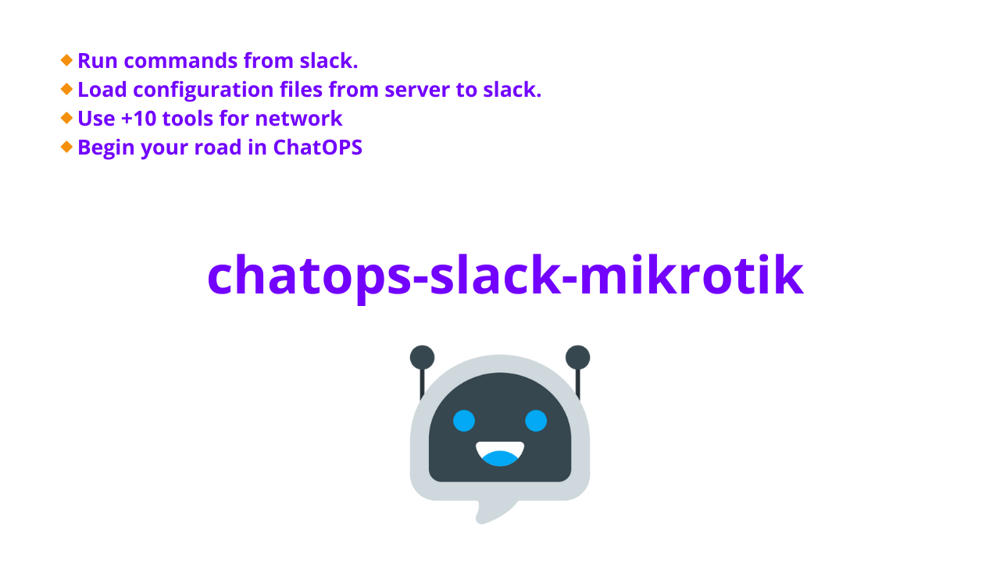

# ChatOPS Mikrotik

Ejecuta comandos a tus equipos Mikrotik desde slack, para casos donde necesitas una información corta y no quieres abrir consola y logearte al equipo por SSH

## features:

- run commands via chat
- load files configuration from server
- 10+ tools of network

## How install

- 🔰 create your bot from https://api.slack.com/ , first use and download this **[Manifest.yaml](https://drive.google.com/file/d/1DHANRDzVD3Tcmv84F_Ao6eLF3_VUmklP/view?usp=sharing)** to create bot on slack, install bot on your organization.
- 🔰 Onces created yuor bot, copy that id from your account slack API (SLACK_BOT_TOKEN, SLACK_SIGNING_SECRET,SLACK_APP_TOKEN), then paste thats token in your project /config/.env
- 🔰 Install **requirements.txt**
- 🔰 Run **main.py**
- 🔰 Invite bot to channel and then write **!kit** to see manual, enjoy it !
